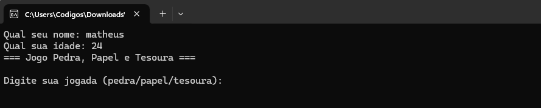
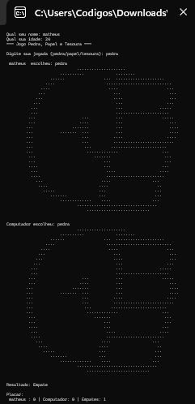
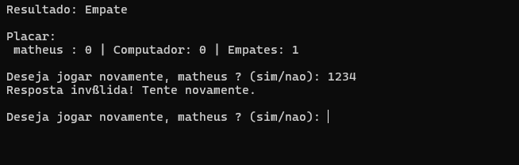
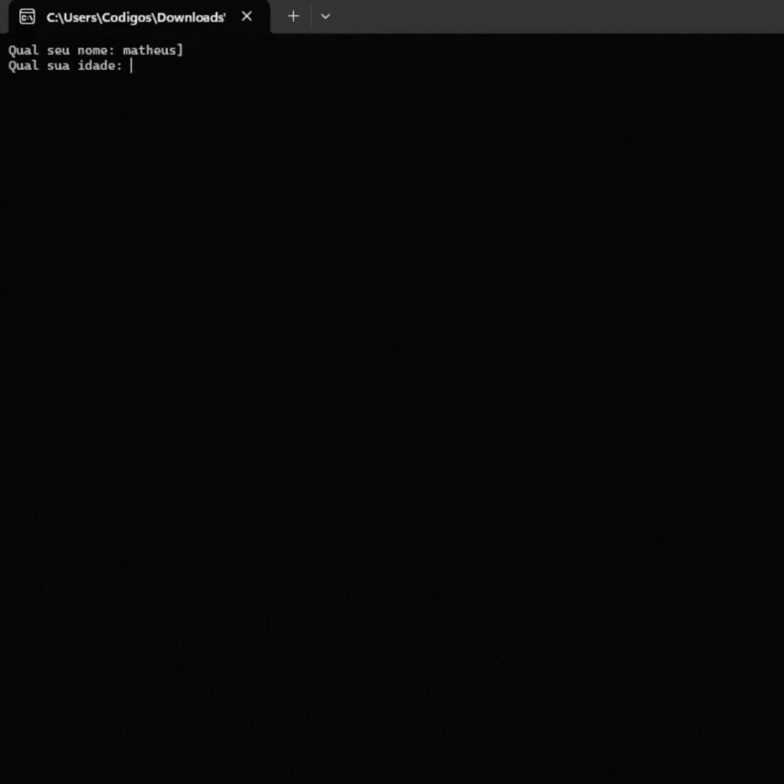

## 1. Resumo do Projeto
 • Imagens do Projeto<br><br>
## Tela 1

### Tela 2

### Tela 3

## Demonstração (GIF)


Neste projeto, o objetivo é criar um programa em C que traga à vida o famoso jogo Pedra, Papel e Tesoura (ou Jokenpô). O programa permitirá que qualquer pessoa crie uma conta informando nome e idade, dispute rodadas contra o próprio computador, acompanhe a pontuação em tempo real e, ao concluir, registre um relatório completo dos jogos e o resultado final em um arquivo. 
Para construir este sistema, foram empregadas técnicas de programação C, como:ponteiros, alocação dinâmica, struct, arquivos e funções.

---

## 2. Estrutura do Código

```text
/oficial
   /bin/Debug
      oficial.exe
   /imagens
      papel.txt
      pedra.txt
      tesoura.txt
   /obj/Debug
      main.o
   main.c
```

---
## 3. Requisitos Atendidos e Onde Estão no Código


| Requisito                | Onde está implementado                | Descrição                                                                                             |
|--------------------------|----------------------------------------|------------------------------------------------------------------------------------------------------|
| Entrada e saída          | `main`, `login()`, `jogar()`           | Leitura do nome/idade, da jogada e das opções de continuar.                                          |
| Estruturas de controle   | `jogar()`, `vencedor()`                | Loops `while` e estruturas `if/else` para validações e determinação do vencedor.                     |
| Ponteiros                | `login()`, `jogar()`                   | Passagem de `struct cadastro` e variáveis de placar por referência (`*p`, `*totalPartidas`, etc.).   |
| Alocação dinâmica        | `jogar()`                              | Uso de `realloc` para aumentar dinamicamente o vetor de histórico.                                   |
| Vetores e matrizes       | `jogar()`                              | O histórico é um vetor de strings (`char**`).                                                        |
| Strings                  | `login()`, `vencedor()`, `jogar()`, `salvarArquivo()` | Manipulação e comparação de strings (`strcmp`, `sprintf`).                            |
| Estruturas heterogêneas  | Globalmente (antes do login)           | Definição da `struct cadastro` para armazenar os dados do jogador.                                   |
| Arquivos                 | `mostrarDesenho()`, `salvarArquivo()`  | Operações de leitura (`fopen(..., "r")`, `fgets`) e escrita (`fopen(..., "w")`, `fprintf`).          |
| Modularização            | Divisão em funções                     | Projeto modularizado em funções dedicadas (`login()`, `jogadaComputador()`, `vencedor()`, etc.).     |

---
## 4. Descrição dos Módulos

### 4.1 main.c
- Inicializa o programa.
- Chama a função login() para cadastrar o jogador.
- Controla o fluxo principal do jogo.
- Gera número aleatório com srand(time(NULL)).
- Chama jogar() para executar as partidas.
- Chama salvarArquivo() para salvar o histórico.
- Libera a memória alocada dinamicamente.

### 4.2 funcoes.h
- Declara a estrutura: struct cadastro (nome e idade).
- Declara protótipos das funções: login(); mostrarDesenho();  
  jogadaComputador(); vencedor(); jogar(); salvarArquivo().

### 4.3 funcoes.c
- login(): Lê nome e idade do jogador.
- mostrarDesenho(): Abre o arquivo tipo “.txt” da pasta ”imagens” e imprime o desenho ASCII correspondente à jogada.
- jogadaComputador(): Gera jogada aleatória (pedra/papel/tesoura).
- vencedor(): Compara jogadas e retorna resultado (empate, jogador venceu, computador venceu).
- jogar(): Função recursiva que executa uma partida, atualiza placar, armazena histórico e pergunta se o jogador deseja continuar.
- salvarArquivo(): Grava histórico e placar final em um arquivo temporário “historico.txt”.

---
## 5. Dificuldades Encontradas

- Manipulação de ponteiros e passagem por referência em funções.
- Uso de malloc e realloc para armazenar histórico de jogadas.
- Validação de entrada do usuário (garantir apenas "pedra", "papel" ou "tesoura").
- Leitura e escrita em arquivos externos.
- Implementação de função recursiva para repetir partidas.

---

## 6. Materiais Utilizados

### WhatsApp
- Usado para discussões rápidas e alinhamentos informais.
- Facilitou a troca de mensagens instantâneas e decisões ágeis.

### Discord
- Utilizado para trabalho em grupo, reuniões virtuais e compartilhamento de tela.
- Permitiu organizar canais temáticos (ex.: código, documentação, dúvidas).

### Miro
- Ferramenta de planejamento visual.
- Usada para criar fluxogramas, mapas mentais e organizar ideias de forma colaborativa.

### CodeBlock
- Plataforma para desenvolver o programa utilizando a linguagem C.

---
## 7. Tratamento de Erros

### • Abertura de arquivos
- Verificar se o arquivo existe antes da leitura (mostrarDesenho()).
- Caso não seja possível abrir, o programa informa ao usuário e continua a execução.

```c
if (!f) {
printf("Erro ao abrir arquivo: %s\n", caminho);
return;
}
```

### • Gravação em arquivos
- A função salvarArquivo() valida se o arquivo pôde ser aberto para escrita.
- Se houver falha, o programa avisa o usuário.
```c
if (!f) {
    printf("Erro ao abrir arquivo!\n");
    return;
}
```

### • Validação de entrada do usuário
- O programa garante que o jogador só possa escolher entre "pedra", "papel" ou "tesoura".
- Caso contrário, solicita nova entrada até que seja válida.
```c
while ( 
(strcmp(escolha, "pedra") != 0) && 
(strcmp(escolha, "papel") != 0) && 
(strcmp(escolha, "tesoura") != 0) 
) {
    printf("Opção inválida! Digite novamente
(pedra/papel/tesoura): ");
    scanf("%s", escolha);
}
```

### • Alocação dinâmica de memória
- Uso de malloc e realloc para armazenar o histórico de jogadas.
- Recomenda-se verificar se o ponteiro retornado não é NULL para evitar falhas críticas (melhoria futura).
```c
// Aumenta dinamicamente o vetor de histórico
*historico = realloc(*historico, (*totalPartidas) * sizeof(char*));

// Aloca espaço para a nova linha do histórico
(*historico)[*totalPartidas - 1] = malloc(100 * sizeof(char));

// Armazena a descrição da partida atual
sprintf((*historico)[*totalPartidas - 1],
        "%s: %s | Computador: %s | %s",
        jogador.nome, escolha, comp, resultado);
```
### • Fallback seguro na jogada do computador
- Caso ocorra erro inesperado no switch, a jogada padrão é "pedra", garantindo que o jogo continue.
```c
default:
    return "pedra"; 
```

### • Validação da resposta ao continuar o jogo
- O programa garante que o usuário só possa responder “sim” ou “nao” quando perguntado se deseja continuar jogando.
- Caso a entrada seja inválida, o usuário é notificado e o programa solicita uma nova resposta até receber um valor permitido:
```c
    if (strcmp(resposta, "sim") == 0) {
        jogar(totalPartidas, historico, pontosJogador, pontosComputador, empates);
        break;
    }
    else if (strcmp(resposta, "nao") == 0 || strcmp(resposta, "não") == 0) {
        printf("\nEncerrando o jogo...\n");
        return;
    }
    else {
        printf("Resposta inválida! Tente novamente.\n");
    }
}
```
### • Validação de entrada no login

- O programa impede que o usuário insira **números no nome**, que a idade contenha **letras ou símbolos**. E Caso a entrada seja inválida, o usuário é avisado e solicitado a inserir novamente até estar correto.

```c
void login(struct cadastro *p) {

    int apenasNumeros(const char *str) {
        for (int i = 0; str[i] != '\0'; i++) {
            if (str[i] < '0' || str[i] > '9') {
                return 0; // não é número
            }
        }
        return 1; // é número
    }

    int nomeValido(const char *nome) {
        for (int i = 0; nome[i] != '\0'; i++) {
            if (nome[i] >= '0' && nome[i] <= '9') {
                return 0; // contém número -> inválido
            }
        }
        return 1; // válido
    }

    printf("Qual seu nome: ");
    scanf(" %[^\n]", p->nome);

    // valida nome
    while (!nomeValido(p->nome)) {
        printf("O nome não pode conter números! Digite novamente: ");
        scanf(" %[^\n]", p->nome);
    }

    char idadeStr[20];
    printf("Qual sua idade: ");
    scanf("%s", idadeStr);

    // valida idade
    while (!apenasNumeros(idadeStr)) {
        printf("A idade deve conter apenas números! Tente novamente: ");
        scanf("%s", idadeStr);
    }

    p->idade = atoi(idadeStr);
}

```
---
## 8. Conclusão
Este trabalho possibilitou colocar em prática vários princípios da linguagem C em uma situação interessante e proveitosa. Foi possível aprofundar o conhecimento sobre estruturas, ponteiros, uso de memória dinâmica, tratamento de dados em arquivos e organização em módulos, fixando o aprendizado. 
O produto final é um jogo que funciona bem, que oferece interação e que pode ser expandido, recebendo melhorias visuais ou compatibilidade com plataformas mais modernas.

---
## 9. Como Replicar o projeto

Siga este passo a passo para baixar o projeto Pedra, Papel e Tesoura e rodar pelo CodeBlocks.
<br>

* Baixar o Projeto

#### Opção A — Baixar como ZIP
1. Acesse o repositório oficial:  
   https://github.com/mathocihara/pedraPapelTesoura
2. Clique no botão **Code** (botão verde).
3. Clique em **Download ZIP**.
4. Extraia o arquivo baixado em uma pasta do seu computador.

#### Opção B — Clonar via Git (opcional)
Se tiver Git instalado, rode:
```bash
git clone https://github.com/mathocihara/pedraPapelTesoura.git
```

* Abrir o Projeto no CodeBlocks

Abra o CodeBlocks.<br>
Vá em File → Open.<br>
Navegue até a pasta onde você extraiu o projeto.<br>
Abra o arquivo main.c (ou oficial.c, caso exista).<br>
Se o CodeBlocks perguntar para criar um projeto baseado nesse arquivo, clique em Yes.<br>

* Compilar o Projeto

No CodeBlocks:
- Pressione **F9**  
  **ou**
- Clique em **Build and Run**

Isso irá compilar o programa e abrir o terminal interno automaticamente.


* Executar o Programa

Após a compilação, o CodeBlocks abrirá o console sozinho.

Se quiser executar manualmente:

- Vá em **Build → Run**  
  **ou**
- Pressione **Ctrl + F10**

---
## 10. Alunos:
Nome: Lian Pinheiro da Silva RA- 2759322<br>
Manoella Antunes Pereira  - RA: 2777169 <br>
Lediandro O. B. Saldanha - RA: 2758946<br>
Matheus Yukio Lopes Hocihara - RA: 2783061

